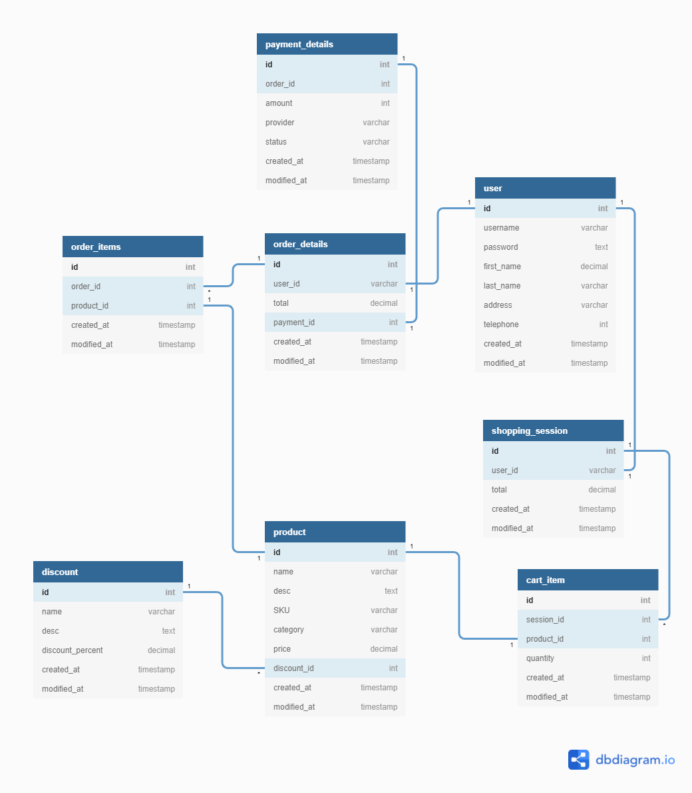

# Title of the RFC <!-- omit in toc -->

### Table Of Contents <!-- omit in toc -->

- [Summary](#summary)
- [Basic Example](#basic-example)
- [Motivation](#motivation)
- [Detailed Design](#detailed-design)
- [Drawbacks/Constraints](#drawbacksconstraints)
- [Alternatives](#alternatives)
- [Adoption strategy](#adoption-strategy)
- [How do we educate people?](#how-do-we-educate-people)
- [Open Questions](#open-questions)
- [References](#references)

# Summary

## What is a Cart Management System?

A shopping cart on an online retailer's site is a piece of software that facilitates the purchase of a product or service. Shopping carts bridge the gap between shopping and buying, so having the best shopping cart software is extremely important on your website. A cart typically has three common aspects:

- It stores product information.
- It's a gateway for order, catalog and customer management.
- It renders product data, categories and site information for user display.

# Motivation

- Why are we doing this?
- What use cases does it support?
- What is the expected outcome?

Try to focus on explaining the motivation so that if this RFC is not accepted, the motivation could be used to develop alternative solutions. In other words, try to list down the constraints you are trying to solve without coupling them too closely to the solution you have in mind.

# Detailed Design

Shopping Cart is the core foundation of any E-Commerce application. An e-commerce shopping cart serves as a virtual cart that allows customers to add and hold items until they complete the purchase. It accepts payments of customers, organizes and distributes all order information to the merchant, customer, and other relevant parties.

This process requires a database to store and retrieve the relevant data while supporting the functionality of the shopping cart. A shopping cart database will contain all the critical information about products, orders, and customers and allow users to perform real-time changes reflected in their shopping session.

## Database Designs

A shopping cart database should be highly available, fault-tolerant, and highly responsive to provide customers a smooth shopping experience 24x7. When designing a shopping cart database, it can be divided into three main components for better categorization and understanding of the underlying data structure.

- Static Data
- Session Data
- Processed Data

### Static Data

This component will include somewhat static data that the customer needs only to retrieve while interacting with a shopping cart. The data is stored in the following types of tables:

- product table
- discount table
- user table

### Session Data

This is the most important component of the shopping cart database where all the live interactions (session details) are stored when the client is interacting with the shopping cart.

- shopping_session table
- cart_item table

### Processed Data

Once the customer completes a transaction, we need to permanently store the order information by moving the Session Data into permanent storage. Additionally, we need to store the payment details.

- order_details table
- order_details table
- payment_details table

## Table Relationships in Database

The following diagram demonstrates the relationships within the above-mentioned tables inside the database using a sample fieldset. The fields in the tables may depend on the requirements of the specific e-commerce platform and can range from a simple to complex list of fields.

# Drawbacks/Constraints

Why should we _not_ do this? Maybe try to consider the following constraints

- Implementation cost, both in terms of code size and complexity.
- The impact of it on new as well as existing consumer projects.
- Cost of migration.

There are tradeoffs to choosing any path. Attempt to identify them here.

# Alternatives

What other designs/patterns/strategies have been considered?

# Adoption strategy

If we implement this proposal, how will existing consumer projects adopt it?

- Is this a breaking change?
- Can we write a codemod?
- How do we prioritise this with business and product folks?
- How do we communicate with other teams? Will updating docs suffice or do we need a dedicated interaction with them?

# How do we educate people?

- How should this be taught to other folks?
- What names and terminology work best for these concepts and why?
- How is this idea best presented?

# Open Questions

- Any open questions that you have?
- Any undiscovered areas that you have encountered?
- Any dependencies on other teams(Design/Engineering) that needs to be resolved upfront?

# References

Any references that you can share for those who are curious to understand anything beyond the scope of this RFC in general but related to the topic of this RFC.
